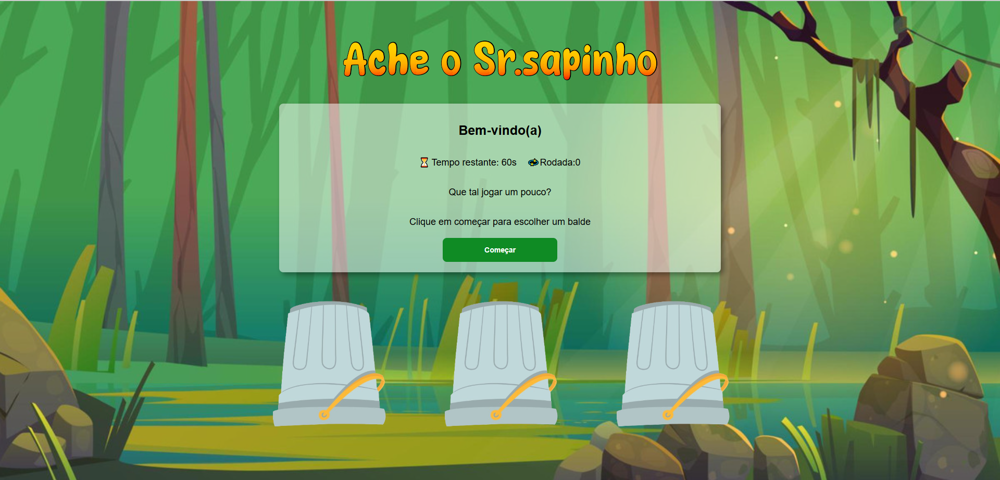

# 🐸 Ache o Sr. Sapinho

Um mini jogo interativo feito com HTML, CSS e JavaScript, onde o desafio é adivinhar em qual balde o Sr. Sapinho está escondido! Mas cuidado: o tempo está passando e só há 3 rodadas pra vencer 👀⏳

---

## 📸 Prévia do jogo

---

## 🎮 Como jogar

1. Clique em **"Começar"**.
2. Escolha um dos três baldes.
3. Tente encontrar o sapinho!
4. Acertou? Avance para a próxima rodada!
5. Errou? Tente novamente clicando em "Recomeçar".

Se acertar os 3 rounds, você vence o jogo! 🎉

---

## 🧪 Tecnologias utilizadas

- **HTML5**
- **CSS3**
- **JavaScript puro**

---

## 📸 Créditos de Imagens e Animações

As imagens e animações utilizadas neste projeto foram encontradas através do Google Imagens e são usadas exclusivamente para fins educacionais e de demonstração.

⚠️ Este projeto **não tem fins comerciais** e **não reivindica propriedade sobre essas mídias**.

Caso você seja o(a) autor(a) de alguma das imagens/animações e deseje que ela seja removida, por favor, entre em contato.

---

## 💡 Objetivo do projeto

Este jogo foi desenvolvido com fins educacionais, para praticar lógica de programação, manipulação do DOM, timers e interações com o usuário. É também uma forma divertida de exercitar criatividade e organização de código.

---

## 🚀 Demonstração

> Esse projeto está disponível apenas como repositório no GitHub por enquanto.  

---

Feito com 🧡 por **Beatriz Marques**

